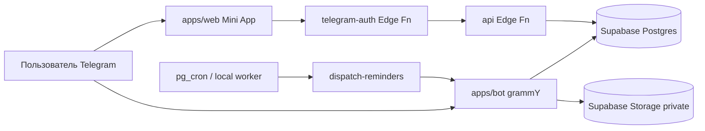

# Архитектура — «Скинь мне»

## Обзор

Monorepo (npm workspaces) с тремя пакетами:

```
skin-mne/
├── apps/bot/          # grammY Telegram bot + local reminder worker
├── apps/web/          # Telegram Mini App (React + Vite)
├── packages/shared/   # Zod schemas, types, constants
└── supabase/          # Postgres migrations + Edge Functions
```

## Поток данных



## Безопасность

- Один владелец: `ALLOWED_TELEGRAM_USER_ID`
- Только личный чат (`private`)
- Service Role Key — только bot и Edge Functions
- Mini App: валидация `initData` на сервере, короткая сессия
- RLS на всех таблицах
- Файлы: private bucket + signed URL (60s)

## Напоминания

1. **Локально:** `apps/bot/src/workers/reminder-dispatcher.ts` — polling каждые 30с
2. **Production:** Edge Function `dispatch-reminders` + cron каждую минуту
3. Claim: `UPDATE ... SET status='processing' WHERE status='scheduled' AND remind_at <= now()`

## Этапы развития

См. [ROADMAP.md](./ROADMAP.md). Каждый этап — отдельный git commit.
